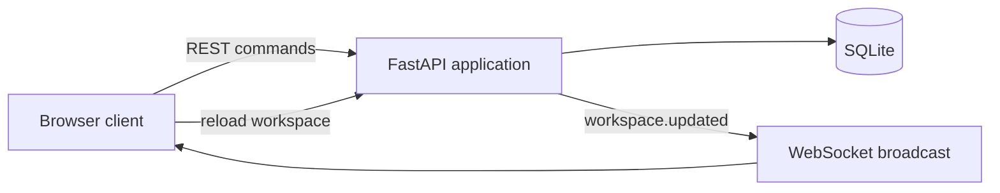

# TeamBoard

[](https://github.com/vishnukanchi9/teamboard/actions/workflows/ci.yml)

A real-time collaborative task workspace built with FastAPI, WebSockets, SQLite, and a responsive browser interface. TeamBoard combines a drag-and-drop sprint board with member management, profile controls, comments, filters, and a live activity feed.

## Architecture



Writes are persisted before the server broadcasts an update. Connected browsers then reload the workspace through the REST API, keeping every open board consistent without duplicating state-transition logic in the WebSocket layer.

## Features

- Drag tasks between **To do**, **In progress**, and **Done** columns.
- Use each task’s action menu to move it or inspect details and comments.
- Filter the board by high priority, in-progress, completed, or all tasks.
- Create tasks with priority, assignee, description, and due date.
- Add, edit, and remove workspace members; removed assignees safely become unassigned.
- Edit the workspace-owner profile from the sidebar.
- Receive live updates across browser tabs through WebSockets.
- Review an activity feed generated by task, member, profile, and comment changes.

## Run with Docker

```powershell
docker compose up --build
```

Open [http://localhost:8000](http://localhost:8000). Data is retained in the `teamboard-data` Docker volume.

Stop the app without deleting its data:

```powershell
docker compose down
```

## Run with Python

```powershell
python -m venv .venv
.\.venv\Scripts\pip install -r requirements.txt
.\.venv\Scripts\uvicorn app.main:app --reload
```

The application creates `teamboard.db` and seeds a demonstration workspace on its first local start. Set `TEAMBOARD_DATABASE` to use another database path.

## Verify

```powershell
.\.venv\Scripts\pytest -q
Invoke-RestMethod http://localhost:8000/healthz
```

The tests cover task movement, member lifecycle operations, profile editing, health reporting, and validation. GitHub Actions runs the suite and builds the production container on every pull request and push to `main`.

## API overview

| Method | Path | Purpose |
| --- | --- | --- |
| `GET` | `/api/workspace` | Load boards, tasks, members, profile, and recent activity |
| `POST` | `/api/tasks` | Create a task |
| `PATCH` | `/api/tasks/{id}` | Move, reprioritize, or reassign a task |
| `GET/POST` | `/api/tasks/{id}/comments` | Read or create task comments |
| `POST` | `/api/members` | Add a workspace member |
| `PATCH/DELETE` | `/api/members/{id}` | Edit or remove a member |
| `PATCH` | `/api/profile` | Edit the workspace-owner profile |
| `WS` | `/ws` | Receive workspace-change notifications |
| `GET` | `/healthz` | Check application health |

## Deliberate limitations

TeamBoard is a single-workspace portfolio application. A production version would use PostgreSQL, authenticated users and workspace permissions, structured migrations, and a shared event layer such as Redis Pub/Sub when running multiple API replicas.
